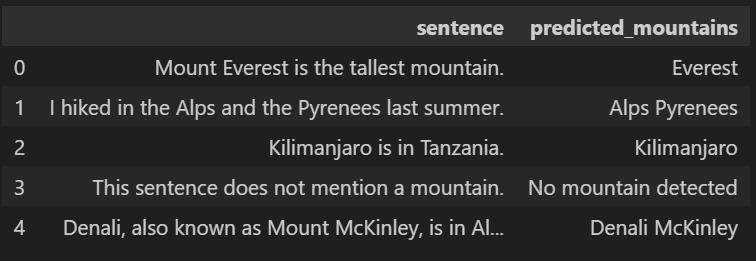

# BERT for Mountain Name Prediction

This project is designed to use a BERT-based model to predict mountain names from a given input text. The model is trained for token classification, and it identifies mountain names based on a labeled dataset.

### Project Structure

```
BERT-FOR-MOUNTNER
│
├── data
│   ├── annotated_100.csv            # Annotated dataset used for training
│   ├── preprocessed_data.pth        # Preprocessed data stored in PyTorch format
│   └── test_dataset.csv             # Test dataset for trained model
│
├── model
│   ├── config.json                  # Configuration file for the model
│   └── put_model_here.txt           # Placeholder for where to store the model
│
├── scripts
│   ├── data_processing_utils.py     # Data preprocessing utilities
│   └── inference_utils.py           # Utilities for inference
│
├── tokenizer
│   ├── special_tokens_map.json      # Mapping for special tokens
│   ├── tokenizer_config.json        # Tokenizer configuration
│   ├── tokenizer.json               # Tokenizer file
│   └── vocab.txt                    # Vocabulary file
│
├── .gitignore                       # Git ignore file
├── Dataset Creation.ipynb           # Notebook for dataset creation and augmentation
├── Demo_model_inference.ipynb       # Notebook for running the inference demo
├── Demo_model_training.ipynb        # Notebook for model training demo
├── model_inference.py               # Script for inference
├── model_training.py                # Script for model training
├── README.md                        # This file
└── requirements.txt                 # Python dependencies
```

### Overview

This repository contains scripts for:

- Training a BERT-based model for identifying mountain names in text (`model_training.py`).
- Inference where users can input text, and the model predicts mountain names (`model_inference.py`).
- Data processing and tokenization for preparing the dataset (`Demo_model_training.ipynb`, `data_processing.py`).
- Model and tokenizer files are stored under the `model/` and `tokenizer/` directories.

### Example of Model Output

Below is an example of the model's performance on test sentences:



### Key Scripts

**model_training.py**
- Prepares and trains the BERT-based model for mountain name recognition.
- Supports multi-label classification using token classification.
- Utilizes weighted loss functions to handle imbalanced datasets.

**model_inference.py**
- Loads the trained model and tokenizer.
- Allows the user to input text and predict mountain names based on the trained model.

**data_processing.py**
- Handles data augmentation for the training dataset.
- Includes tokenization and alignment of labels with sentences for training.

**inference_utils.py**
- Provides utility functions for loading the model, preprocessing text, and making predictions.

### Requirements
To install the necessary dependencies, run:
```bash
pip install -r requirements.txt
```

### Model Weights

You can download the model weights from the following link:

[Download Model](https://huggingface.co/AnnaDee/BERT-for-MountNER/blob/main/model.safetensors)

### How to Train the Model

1. Prepare your annotated data in CSV format and place it under the data/ directory.
2. Modify the model_training.py to specify your dataset and configure any training parameters.
3. Run the script:
```bash
python model_training.py
```

### How to Run Inference

1. Place the trained model and tokenizer under the model/ and tokenizer/ directories, respectively.
2. Run the inference script:
```bash
python model_inference.py
```
The script will ask for text input and output the predicted mountain names.

### Notes

- The model uses a pre-trained BERT base model (bert-base-cased).
- Token classification is done for three labels: "O" (outside), "B-MOUNT" (beginning of a mountain name), and "I-MOUNT" (inside a mountain name).
- The dataset includes both annotated and augmented data to improve the model's robustness.